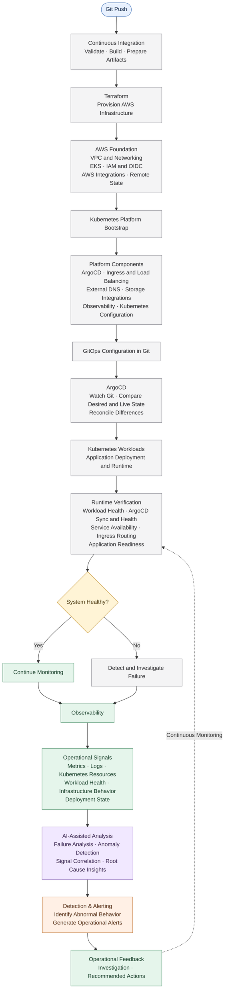

# KUBAPP — Execution Flow

```mermaid
flowchart TD
    A(["Git Push"]) --> B["Continuous Integration<br/>Validate · Build · Prepare Artifacts"]

    B --> C["Terraform<br/>Provision AWS Infrastructure"]

    C --> C1["AWS Foundation<br/>VPC and Networking<br/>EKS · IAM and OIDC<br/>AWS Integrations · Remote State"]

    C1 --> D["Kubernetes Platform Bootstrap"]

    D --> D1["Platform Components<br/>ArgoCD · Ingress and Load Balancing<br/>External DNS · Storage Integrations<br/>Observability · Kubernetes Configuration"]

    D1 --> E["GitOps Configuration in Git"]

    E --> F["ArgoCD<br/>Watch Git · Compare Desired and Live State<br/>Reconcile Differences"]

    F --> G["Kubernetes Workloads<br/>Application Deployment and Runtime"]

    G --> H["Runtime Verification<br/>Workload Health · ArgoCD Sync and Health<br/>Service Availability · Ingress Routing<br/>Application Readiness"]

    H --> I{"System Healthy?"}

    I -- Yes --> J["Continue Monitoring"]
    I -- No --> K["Detect and Investigate Failure"]

    J --> L["Observability"]
    K --> L

    L --> L1["Operational Signals<br/>Metrics · Logs · Kubernetes Resources<br/>Workload Health · Infrastructure Behavior<br/>Deployment State"]

    L1 --> N["AI-Assisted Analysis<br/>Failure Analysis · Anomaly Detection<br/>Signal Correlation · Root Cause Insights"]

    N --> O["Detection & Alerting<br/>Identify Abnormal Behavior<br/>Generate Operational Alerts"]

    O --> M["Operational Feedback<br/>Investigation · Recommended Actions"]

    M -. "Continuous Monitoring" .-> H

    classDef source fill:#e8f1ff,stroke:#4776b9,color:#172b4d
    classDef process fill:#f4f4f5,stroke:#71717a,color:#27272a
    classDef decision fill:#fff4d6,stroke:#c28b20,color:#49340a
    classDef observe fill:#e5f5eb,stroke:#39845a,color:#153d27
    classDef ai fill:#f1e8ff,stroke:#8660b5,color:#34204d
    classDef alert fill:#fff0e5,stroke:#c27839,color:#542b12

    class A source
    class B,C,C1,D,D1,E,F,G,H,K process
    class I decision
    class J,L,L1,M observe
    class N ai
    class O alert
```
